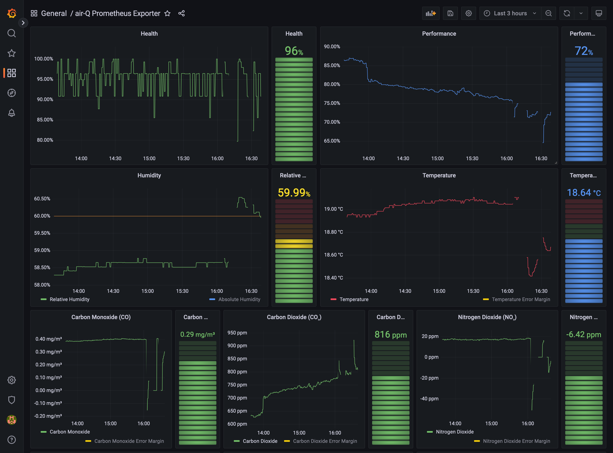

# air-Q Prometheus Exporter

This is a Prometheus exporter for the air-Q, an air quality measuring device. The air-Q data is exported as Prometheus text metrics (or JSON) and can be visualized e.g. in Grafana.



The following sensors or metrics are supported:

| Metric         | English Name                  | German Name                    | Unit  | Type   | Has Error Margin? |
|----------------|-------------------------------|--------------------------------|-------|--------|-------------------|
| health         | Health                        | Gesundheitsindex               | %     | double | no                |
| no2            | Nitrogen Dioxide              | Stickstoffdioxid               | µg/m³ | double | yes               |
| performance    | Performance                   | Leistungsindex                 | %     | double | no                |
| o3             | Ozone                         | Ozon                           | µg/m³ | double | yes               |
| oxygen         | Oxygen                        | Sauerstoff                     | %     | double | yes               |
| so2            | Sulfur Dioxide                | Schwefeldioxid                 | µg/m³ | double | yes               |
| co2            | Carbon Dioxide                | Kohlendioxid                   | ppm   | double | yes               |
| sound          | Noise                         | Lärm                           | dB(A) | double | yes               |
| sound_max      | Noise (Maximum)               | Lärm (Maximum)                 | dB(A) | double | yes               |
| tvoc           | VOC                           | VOC                            | ppb   | double | yes               |
| humidity       | Relative Humidity             | Relative Luftfeuchtigkeit      | %     | double | yes               |
| co             | Carbon Monoxide               | Kohlenmonoxid                  | mg/m³ | double | yes               |
| humidity_abs   | Absolute Humidity             | Absolute Luftfeuchtigkeit      | g/m³  | double | yes               |
| pm1            | PM1 Particulate Matter        | PM1 Feinstaub                  | µg/m³ | double | yes               |
| temperature    | Temperature                   | Temperatur                     | °C    | double | yes               |
| fahrenheit     | Temperature                   | Temperatur                     | °F    | double | yes               |
| pm2_5          | PM2.5 Particulate Matter      | PM2.5 Feinstaub                | µg/m³ | double | yes               |
| pressure       | Air Pressure                  | Luftdruck                      | hPa   | double | yes               |
| pressure_rel   | Relative Air Pressure         | Relativer Luftdruck            | hPa   | double | yes               |
| pm10           | PM10 Particulate Matter       | PM10 Feinstaub                 | µg/m³ | double | yes               |
| dewpt          | Dew Point                     | Taupunkt                       | °C    | double | yes               |
| h2s            | Hydrogen Sulfide              | Schwefelwasserstoff            | µg/m³ | double | yes               |
| n2o            | Nitrous Oxide                 | Lachgas                        | µg/m³ | double | yes               |
| pm2_5_SPS30    | PM2.5 Particulate Matter (AUX) | PM2.5 Feinstaub (AUX)          | µg/m³ | double | yes               |
| pm10_SPS30     | PM10 Particulate Matter (AUX) | PM10 Feinstaub (AUX)           | µg/m³ | double | yes               |
| pm4_SPS30      | PM4 Particulate Matter (AUX)  | PM4 Feinstaub (AUX)            | µg/m³ | double | yes               |
| pm1_SPS30      | PM1 Particulate Matter (AUX)  | PM1 Feinstaub (AUX)            | µg/m³ | double | yes               |
| TypPS_SPS30    | Typical Particle Size (AUX)   | Typ. Partikelgröße (AUX)       | µm    | double | no                |
| TypPS          | Typical Particulate Size      | Typische Partikelgröße         | µm    | double | no                |
| ch4_MIPEX      | Methane                       | Methan                         | %     | double | yes               |
| c3h8_MIPEX     | Propane                       | Propan                         | %     | double | yes               |
| tvoc_ionsc     | VOC (ION Science)             | VOC (ION Science)              | ppb   | double | yes               |
| radon          | Radon                         | Radon                          | Bq/m³ | double | yes               |
| no2_insplorion | NO2 (Insplorion)              | NO2 (Insplorion)               | µg/m³ | double | yes               |
| ethanol        | Alcohol                       | Alkohol                        | µg/m³ | double | yes               |
| iaq_spec       | IAQ (SPEC)                    | IAQ (SPEC)                     | ppb   | double | yes               |
| resp_irr_spec  | Respiratory Irritant Gases    | Atemwegsreizende Gase          | ppb   | double | yes               |
| nh3_MR100      | Ammonia                       | Ammoniak                       | µg/m³ | double | yes               |
| acid_M100      | Organic Acid                  | Organische Säure               | µg/m³ | double | yes               |
| h2_M1000       | hydrogen                      | Wasserstoff                    | µg/m³ | double | yes               |
| no_M250        | Nitrogen Monoxide             | Stickstoffmonoxid              | µg/m³ | double | yes               |
| cl2_M20        | Chlorine                      | Chlor                          | µg/m³ | double | yes               |
| br2            | Bromine                       | Brom                           | µg/m³ | double | yes               |
| f2             | Fluorine                      | Fluor                          | µg/m³ | double | yes               |
| hf             | Hydrogen fluoride             | Fluorwasserstoff               | µg/m³ | double | yes               |
| hcn            | Hydrogen cyanide              | Cyanwasserstoff                | µg/m³ | double | yes               |
| hcl            | Hydrogen chloride             | Chlorwasserstoff               | µg/m³ | double | yes               |
| ch4s           | Methanethiol                  | Methanthiol                    | µg/m³ | double | yes               |
| clo2           | Chlorine dioxide              | Chlordioxid                    | µg/m³ | double | yes               |
| cs2            | Carbon disulfide              | Kohlenstoffdisulfid            | µg/m³ | double | yes               |
| ph3            | Phosphane                     | Phosphan                       | µg/m³ | double | yes               |
| sih4           | Silane                        | Silan                          | µg/m³ | double | yes               |
| c2h4           | Ethene                        | Ethen                          | µg/m³ | double | yes               |
| c2h4o          | Oxirane                       | Oxiran                         | µg/m³ | double | yes               |
| ash3           | Arsane                        | Arsan                          | µg/m³ | double | yes               |
| h2o2           | Hydrogen peroxide             | Wasserstoffperoxid             | µg/m³ | double | yes               |
| refrigerant    | Refrigerant                   | Kältemittel                    | µg/m³ | double | yes               |
| ch2o_M10       | Formaldehyde                  | Formaldehyd                    | µg/m³ | double | yes               |
| dCO2dt         | Change of CO₂ concentration   | Änderung der CO₂ Konzentration |       | int    | no                |
| dHdt           | Change of Humidity            | Änderung der Luftfeuchtigkeit  |       | int    | no                |
| measuretime    | Duration of measurement       | Dauer der Messung              | ms    | int    | no                |
| timestamp      | Timestamp                     | Timestamp                      |       | long   | no                |
| uptime         | Uptime                        | Uptime                         | s     | long   | no                |
| Status         | Status                        | Status                         |       | string | no                |
| DeviceID       | Device ID                     | Geräte-ID                      |       | string | no                |

## Usage

The command line application can be configured via parameters or environment variables.

### Parameters

| Command Line Parameter            | Environment Variable | Default Value | Description                                                                                       |
|-----------------------------------|---|---------------|---------------------------------------------------------------------------------------------------|
| `-h` or `--host "<host>"`         | `AIRQ_PROM_EXP_HOST` |               | IP address or host name of the air-Q e.g. `192.168.178.46` or `airq.local`.                       |
| `-p` or `--password "<password>"` | `AIRQ_PROM_EXP_PASSWORD` |               | Password of the air-Q                                                                             |
| `-s` or `--port "<port>"`         | `AIRQ_PROM_EXP_PORT` | 8080          | Port of the webserver. The server will serve Prometheus data at `http://localhost:<port>/metrics` |
| `-h` or `--help`                  |  |           | Shows a help message                                                                              |
| `-v` or `--version`               |  |           | Shows the version                                                                                 |

### Running

#### Standalone with Java (`java -jar`)

> [!NOTE]  
> An installation of Java > 11 is required to run this application.

Start the application from the command line by executing the following command:

```shell
java -jar airq-prometheus-exporter.jar --host "192.168.178.46" --password "myPassword123" --port "8080"
```

One can also set the environment variables and call the application without arguments.

```shell
export AIRQ_PROM_EXP_HOST="192.168.178.46"
export AIRQ_PROM_EXP_PASSWORD="myPassword123"
export AIRQ_PROM_EXP_PORT="8080"

java -jar airq-prometheus-exporter.jar
```

#### With Docker (`docker run`)

> [!IMPORTANT]  
> At the moment there is no published Docker image on Docker Hub. However, it is possible to build the image manually.

If a Docker image exists, one can run the application with the following command:

```shell
docker run -d -e export AIRQ_PROM_EXP_HOST="192.168.178.46" AIRQ_PROM_EXP_PASSWORD="myPassword123" AIRQ_PROM_EXP_PORT="8080" -p 8080:8080 --name air-prometheus-exporter air-prometheus-exporter
```

This will map the port `8080` from inside the container to the port `8080` on the outside. If you change the port with `AIRQ_PROM_EXP_PORT` or `--port` you also have to change the port mapping in this command.

#### With Docker (`docker compose`)

> [!IMPORTANT]  
> At the moment there is no published Docker image on Docker Hub. However, it is possible to build the image manually.

Create a file `docker-compose.yml` with the following content:

```yml
version: '2'
services:
  airq-prometheus-exporter:
    container_name: airq-prometheus-exporter
    image: airq-prometheus-exporter
    command: '-h "192.168.178.46" -p "myPassword123" -s "8080"'
    ports:
      - '8080:8080'
```

### HTTP Endpoints

The application will expose four HTTP endpoints that display the air-Q data or loaded configuration in different formats.

1. `http://localhost:<port>/metrics`

    Serves the air-Q data as Prometheus metrics format (`text/plain; version=0.0.4; charset=utf-8`).

    Example:

    ```
    # HELP airq_timestamp Timestamp
    # TYPE airq_timestamp gauge
    airq_timestamp{device="c1c8f61092e7c1f607359324880fcb33",} 1.707151608E12
    # HELP airq_uptime Uptime (s)
    # TYPE airq_uptime gauge
    airq_uptime{device="c1c8f61092e7c1f607359324880fcb33",} 4598.0
    # HELP airq_pressure Air Pressure (hPa)
    # TYPE airq_pressure gauge
    airq_pressure{device="c1c8f61092e7c1f607359324880fcb33",} 1006.89
    # HELP airq_co Carbon Monoxide (mg/m³)
    # TYPE airq_co gauge
    airq_co{device="c1c8f61092e7c1f607359324880fcb33",} 0.403
   ...
    ```

2. `http://localhost:<port>/data-raw`

    Serves the raw unprocessed (but decrypted) air-Q data.

    Example:
    
    ```json
    {"co2":[938.0,78.1],"humidity":[60.452,3.86],"TypPS":2.4,"humidity_abs":[9.759,0.49],"sound":[27.1,13.0],"sound_max":[74.6,1.9],"timestamp":1707147049000,"health":723,"dHdt":0.0,"dCO2dt":0.0,"pm2_5":[11,11],"Status":{"co":"co sensor still in warm up phase; waiting time = 177 s","tvoc":"tvoc sensor still in warm up phase; waiting time = 177 s","no2":"no2 sensor still in warm up phase; waiting time = 177 s"},"pressure":[1007.15,1.0],"pm1":[1,10],"uptime":41,"DeviceID":"abcdefg","temperature":[18.77,0.54],"measuretime":946,"dewpt":[11.142,0.77],"performance":633.849,"pm10":[11,11]}
    ```

3. `http://localhost:<port>/data-parsed`

   Serves the internal representation of the air-Q data.
   
   Example:
   
   ```json
   {
     "deviceId": "abcdefg",
     "sensorData": {
       "tvoc": {
         "id": "tvoc",
         "value": 0,
         "errorMargin": 0
       },
       "co2": {
         "id": "co2",
         "value": 801,
         "errorMargin": 74
       },
       "sound": {
         "id": "sound",
         "value": 32,
         "errorMargin": 9.3
       },
       "sound_max": {
         "id": "sound_max",
         "value": 39.3,
         "errorMargin": 5.6
       },
   ...
   ```

## Build the JAR

Build a runnable JAR with the following Maven command:

```shell
mvn clean package -DskipTests
```

## Build the Docker Image

Build a Docker image for the Raspberry Pi with the following command:

```shell
docker build -t airq-prometheus-exporter . --platform linux/arm64/v8
```

Build a Docker image for macOS with the following command:

```shell
docker build -t airq-prometheus-exporter . --platform linux/amd64
```

## Test

> [!NOTE]  
> This section is incomplete and consists of notes for me to deploy the application on my Raspberry Pi.

Run the Docker image locally:

```shell
docker compose up -d
```

Export the image to a *tar* file `airq-prometheus-exporter.tar`

```shell
docker save --output "airq-prometheus-exporter.tar" "airq-prometheus-exporter"
```

Copy the image to the Raspberry Pi with *scp*.

```shell
scp "airq-prometheus-exporter.tar" "username@raspberrypi:~/airq-prometheus-exporter"
```

Import image from *tar* file

```shell
docker load --input "airq-prometheus-exporter.tar"
```

## Grafana

The Grafana dashboard is available at https://grafana.com/grafana/dashboards/20561-air-q-prometheus-exporter/.
To install it in your Grafana instance, follow the instructions below:

1. Open your Grafana interface and hover over the *Dashboard* icon on the left.
2. Click the *Import* menu.
3. Enter the id `20561` into the text field *Import via grafana.com* and click *load*.
4. On the following page choose your Prometheus instance and click *Import*.

The Grafana dashboard is also available as a JSON file in the folder `grafana-dashboard`. The installation is described below:

1. Download the JSON file from folder `grafana-dashboard`.
2. Open your Grafana interface and hover over the *Dashboard* icon on the left.
3. Click the *Import* menu.
4. Upload the dashboard file by clicking on the button *Upload JSON file*

The Grafana dashboard has visualizations for the air-Q pro that comes with 14 sensors.
The following metrics are supported:

| Metric         | English Name                  | German Name                    | Unit  | Type   | Has Error Margin? |
|----------------|-------------------------------|--------------------------------|-------|--------|-------------------|
| health         | Health                        | Gesundheitsindex               | %     | double | no                |
| performance    | Performance                   | Leistungsindex                 | %     | double | no                |
| no2            | Nitrogen Dioxide              | Stickstoffdioxid               | µg/m³ | double | yes               |
| co2            | Carbon Dioxide                | Kohlendioxid                   | ppm   | double | yes               |
| sound          | Noise                         | Lärm                           | dB(A) | double | yes               |
| sound_max      | Noise (Maximum)               | Lärm (Maximum)                 | dB(A) | double | yes               |
| tvoc           | VOC                           | VOC                            | ppb   | double | yes               |
| humidity       | Relative Humidity             | Relative Luftfeuchtigkeit      | %     | double | yes               |
| co             | Carbon Monoxide               | Kohlenmonoxid                  | mg/m³ | double | yes               |
| humidity_abs   | Absolute Humidity             | Absolute Luftfeuchtigkeit      | g/m³  | double | yes               |
| temperature    | Temperature                   | Temperatur                     | °C    | double | yes               |
| pm1            | PM1 Particulate Matter        | PM1 Feinstaub                  | µg/m³ | double | yes               |
| pm2_5          | PM2.5 Particulate Matter      | PM2.5 Feinstaub                | µg/m³ | double | yes               |
| pm10           | PM10 Particulate Matter       | PM10 Feinstaub                 | µg/m³ | double | yes               |
| pressure       | Air Pressure                  | Luftdruck                      | hPa   | double | yes               |
| dewpt          | Dew Point                     | Taupunkt                       | °C    | double | yes               |
| TypPS          | Typical Particulate Size      | Typische Partikelgröße         | µm    | double | no                |
| dCO2dt         | Change of CO₂ concentration   | Änderung der CO₂ Konzentration |       | int    | no                |
| dHdt           | Change of Humidity            | Änderung der Luftfeuchtigkeit  |       | int    | no                |
| measuretime    | Duration of measurement       | Dauer der Messung              | ms    | int    | no                |
| timestamp      | Timestamp                     | Timestamp                      |       | long   | no                |
| uptime         | Uptime                        | Uptime                         | s     | long   | no                |
| Status         | Status                        | Status                         |       | string | no                |

## License

This project is open source licensed under the BSD 3-Clause License. Please see the [LICENSE file](LICENSE) for more information.
